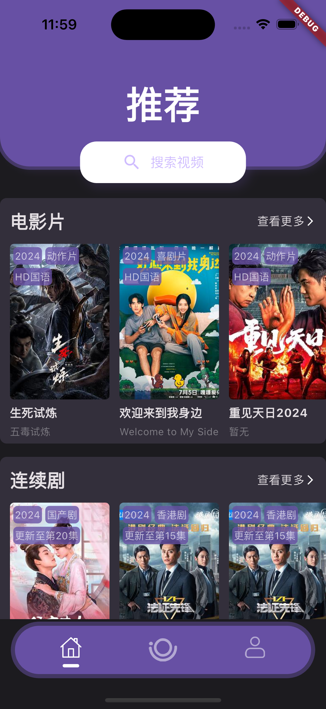
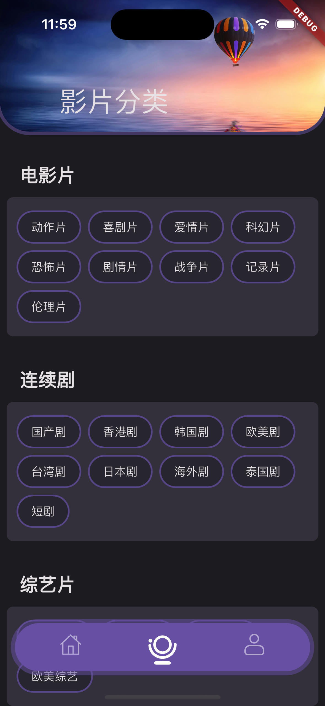
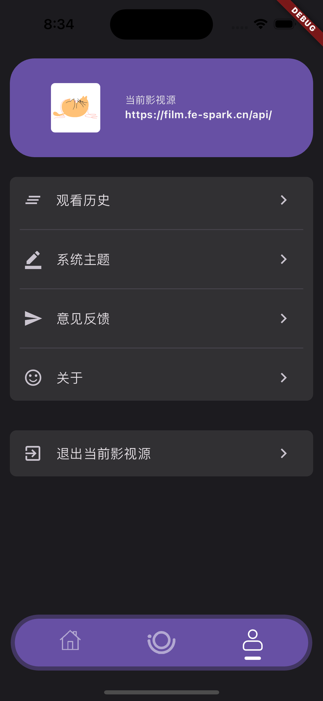
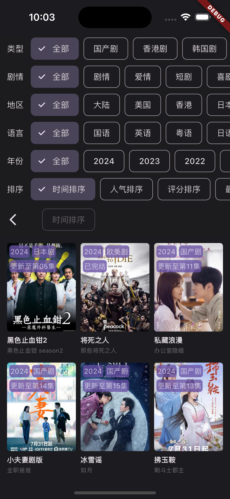

## Bracket

> A video App based on Flutter

  

## Film data source

本项目通过[GoFilm](https://github.com/ProudMuBai/GoFilm)接入数据，如有条件可自行部署云端服务(项目中含有多种部署方案),部署后自行修改`/lib/service/http_util.dart`文件中的`options.baseUrl`进行接入。

## Getting Started

```
flutter run
```

## Build

IOS(无企业签名，请自行签名)

```
flutter build ipa
```

ADNDROID

```
flutter build apk
```

## Preview

|                                    |                                    |                                    |                                    |
| ---------------------------------- | ---------------------------------- | ---------------------------------- | ---------------------------------- |
|  |  |  |  |

## Matters needing attention

> 关于账号密码问题
> 请在项目源码中获取，没有做后台鉴权，之后版本考虑废弃登陆

## Write at the end

> 免责声明：数据来源均来自于网络，暂不提供下载功能，本项目仅供学习交流
