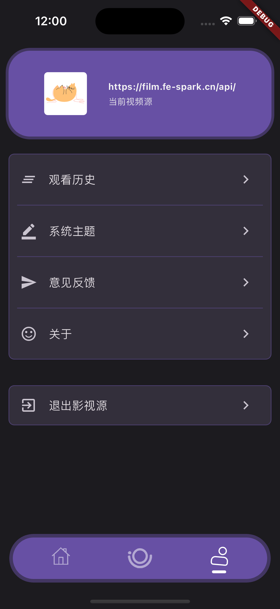

## Bracket

> A video App based on Flutter

  

## Film data source

本项目通过[GoFilm](https://github.com/ProudMuBai/GoFilm)接入数据，如有条件可自行部署云端服务(项目中含有多种部署方案)

[网页版观影地址](https://film.fe-spark.cn/)

## Getting Started

```
flutter run
```

## Build

IOS(无企业签名，请自行签名)

```
flutter build ipa
```

ADNDROID

```
flutter build apk
```

## Preview

| 推荐                               | 分类                               | 我的                               | 详情                               |
| ---------------------------------- | ---------------------------------- | ---------------------------------- | ---------------------------------- |
|  |  |  |  |

## Matters needing attention

> 关于影视源问题
> 提供官方源`https://film.fe-spark.cn/api/`(末尾一定要带`/`),如部署好[GoFilm](https://github.com/ProudMuBai/GoFilm)可以自行修改成自己的源

## Write at the end

> 免责声明：数据来源均来自于网络，暂不提供下载功能，本项目仅供学习交流
